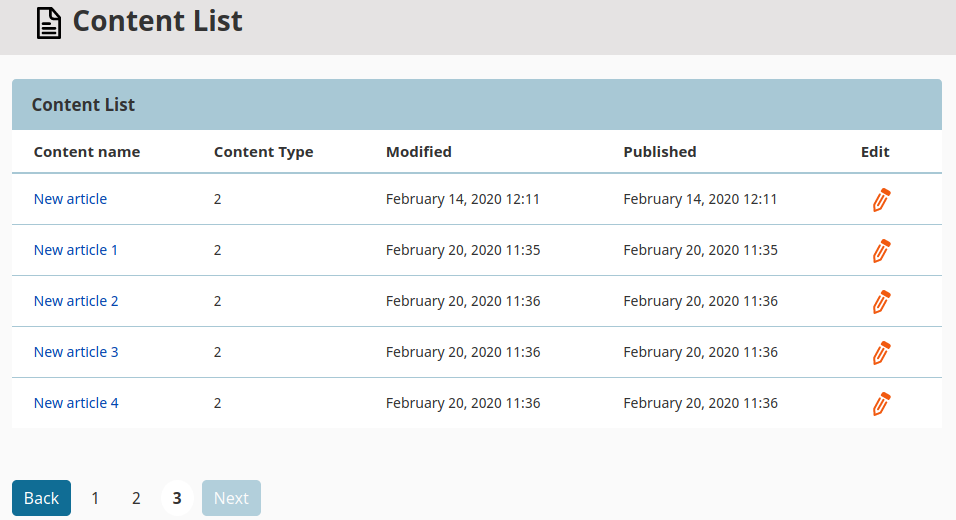

# Step 3b - Adding Edit button to content list

In this step you will add an edit button to the content list. The following tutorial is based on the [Step 2 - Creating a content list](2_creating_a_content_list.md).

## Modify the controller

Introduce changes to `src/Controller/AllContentListController.php`, so that it allows content editing from the content list.

First, add the new `FormFactory $formFactory` parameter and the `$this->formFactory = $formFactory;` argument to the `__construct` function:

```php hl_lines="1 5"
    public function __construct(SearchService $searchService, ContentTypeService $contentTypeService, FormFactory $formFactory)
    {
        $this->searchService = $searchService;
        $this->contentTypeService = $contentTypeService;
        $this->formFactory = $formFactory;
    }
```

Next, provide a new use statement for `FormFactory` parameter:

```php
use EzSystems\EzPlatformAdminUi\Form\Factory\FormFactory;
```

After the lines setting the `$paginator` parameters, add the following code line:

```php
$editForm = $this->formFactory->contentEdit();
```

Finally, provide the new parameter to `$this->render`, after `articles`:

``` php
'form_edit' => $editForm->createView(),
```

??? tip "Complete controller code"

    ```php hl_lines="6 20 24 36 40"
    <?php
    
    namespace App\Controller;
    
    use EzSystems\EzPlatformAdminUiBundle\Controller\Controller;
    use EzSystems\EzPlatformAdminUi\Form\Factory\FormFactory;
    use eZ\Publish\API\Repository\SearchService;
    use eZ\Publish\API\Repository\ContentTypeService;
    use eZ\Publish\API\Repository\Values\Content\Query\Criterion;
    use eZ\Publish\API\Repository\Values\Content\LocationQuery;
    use eZ\Publish\Core\Pagination\Pagerfanta\LocationSearchAdapter;
    use Pagerfanta\Pagerfanta;
    
    class AllContentListController extends Controller
    {
        private $searchService;
    
        private $contentTypeService;
    
        public function __construct(SearchService $searchService, ContentTypeService $contentTypeService, FormFactory $formFactory)
        {
            $this->searchService = $searchService;
            $this->contentTypeService = $contentTypeService;
            $this->formFactory = $formFactory;
        }
    
        public function listAction($page = 1)
        {
            $query = new LocationQuery();        $criterions = [
            new Criterion\Visibility(Criterion\Visibility::VISIBLE),
        ];        $query->query = new Criterion\LogicalAnd($criterions);        $paginator = new Pagerfanta(
            new LocationSearchAdapter($query, $this->searchService)
        );
            $paginator->setMaxPerPage(8);
            $paginator->setCurrentPage($page);
            $editForm = $this->formFactory->contentEdit();
            return $this->render('list/all_content_list.html.twig', [
                'totalCount' => $paginator->getNbResults(),
                'articles' => $paginator,
                'form_edit' => $editForm->createView(),
            ]);
        }
    }
    ```

## Change the template

The last thing to do is to add the edit button to the content list template.
All below code blocks should be added to `templates/list/all_content_list.html.twig`.

First, add `<th>{{ 'Edit'|trans }}</th>` header to the content list table inside `<section class="container my-4">`:

```html+twig  hl_lines="8"
<table class="table">
    <thead>
    <tr>
        <th>{{ 'Content name'|trans }}</th>
        <th>{{ 'Content Type'|trans }}</th>
        <th>{{ 'Modified'|trans }}</th>
        <th>{{ 'Published'|trans }}</th>
        <th>{{ 'Edit'|trans }}</th>
    </tr>
    </thead>
```

Next, add the edit button as a new <td> tag inside `<section class="container my-4">`:

```html+twig
<td>
    <button class="btn btn-icon mx-2 ez-btn--content-edit"
            title="{{ 'dashboard.table.all.content.edit'|trans|desc('Edit Content') }}"
            data-content-id="{{ article.contentInfo.id }}"
            data-version-no="{{ article.contentInfo.currentVersionNo }}"
            data-language-code="{{ article.contentInfo.mainLanguageCode }}">
        <svg class="ez-icon ez-icon-edit">
            <use xlink:href="{{ asset('bundles/ezplatformadminui/img/ez-icons.svg') }}#edit"></use>
        </svg>
    </button>
</td>
```

After that, add a hidden form with js listeners for draft conflict checks by adding the following code block inside ``, right under `<section class="container my-4">`:

```html+twig
{{ form_start(form_edit, {
    'action': path('ezplatform.content.edit'),
    'attr':
    { 'class': 'ez-edit-content-form'}
}) }}
{{ form_widget(form_edit.language, {'attr': {'hidden': 'hidden', 'class': 'language-input'}}) }}
{{ form_end(form_edit) }}

```

Finally, add a javascript block at the end of the twig file:

```html+twig

    {{ encore_entry_script_tags('ezplatform-admin-ui-dashboard-js', null, 'ezplatform') }}


```

### Render button

??? tip "Complete template code"

    ``` html+twig hl_lines="30 40 41 42 43 44 45 46 47 48 49 50 57 58 59 60 61 62 63 64 67 68 69"
    
    
    {{ 'Content List'|trans }}
    
    
        
    
    
    
        
    
    
    
        <section class="container my-4">
            <div class="ez-table-header">
                <div class="ez-table-header__headline">{{ "Content List"|trans }}</div>
            </div>
            <table class="table">
                <thead>
                <tr>
                    <th>{{ 'Content name'|trans }}</th>
                    <th>{{ 'Content Type'|trans }}</th>
                    <th>{{ 'Modified'|trans }}</th>
                    <th>{{ 'Published'|trans }}</th>
                    <th>{{ 'Edit'|trans }}</th>
                </tr>
                </thead>
                <tbody>
                
                    <tr>
                        <td><a href={{path('ez_urlalias', {'contentId': article.contentInfo.id})}}>{{ ez_content_name(article.contentInfo) }}</a></td>
                        <td>{{ article.contentInfo.contentTypeId }}</td>
                        <td>{{ article.contentInfo.modificationDate|ez_full_datetime }}</td>
                        <td>{{ article.contentInfo.publishedDate|ez_full_datetime }}</td>
                        <td>
                            <button class="btn btn-icon mx-2 ez-btn--content-edit"
                                    title="{{ 'dashboard.table.all.content.edit'|trans|desc('Edit Content') }}"
                                    data-content-id="{{ article.contentInfo.id }}"
                                    data-version-no="{{ article.contentInfo.currentVersionNo }}"
                                    data-language-code="{{ article.contentInfo.mainLanguageCode }}">
                                <svg class="ez-icon ez-icon-edit">
                                    <use xlink:href="{{ asset('bundles/ezplatformadminui/img/ez-icons.svg') }}#edit"></use>
                                </svg>
                            </button>
                        </td>
                    </tr>
                
                </tbody>
            </table>
            {{ pagerfanta(articles, 'ez') }}
        </section>    
        {{ form_start(form_edit, {
            'action': path('ezplatform.content.edit'),
            'attr':
            { 'class': 'ez-edit-content-form'}
        }) }}
        {{ form_widget(form_edit.language, {'attr': {'hidden': 'hidden', 'class': 'language-input'}}) }}
        {{ form_end(form_edit) }}
        
    
    
    
        {{ encore_entry_script_tags('ezplatform-admin-ui-dashboard-js', null, 'ezplatform') }}
    
    ```

## Check results

!!! tip

    If you cannot see the results or encounter an error, clear the cache and reload the application.

At this point you should see the edit button beside each content item in the content list.
Select the edit button to change your content items.


